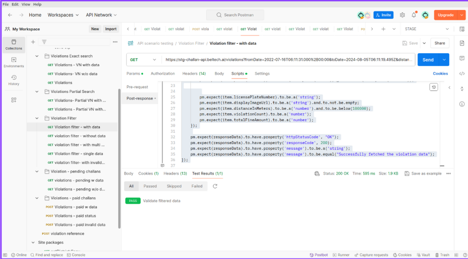

# 🚀 API Testing – Internship Project  

This repository documents my **API Testing internship at Beltech AI**, where I performed automated and manual testing on real-world applications. The project demonstrates API validation, request/response testing, and data verification using **Postman** with **JavaScript (ChaiJS assertions)**.  

---

## 📌 Project Overview  

- Tested APIs for multiple apps including:  
  - Rider & Driver app (user onboarding, login, trip flows)  
  - eChallan app (vehicle violations, challan status, payments)  
  - Trip Booking module (data updates: locations, images, dates)  
- Documented and executed **test cases** for each API endpoint.  
- Performed **manual testing** alongside automated checks.  

---

## 🛠️ Tools & Tech  

- **Postman** – API testing & execution  
- **JavaScript (ChaiJS)** – scripting & assertions  
- **Slack & GitHub** – collaboration & version control  

---

## 📂 Files in this Repo  

- `api_test_script.js` → Sample Postman test script using **ChaiJS** assertions  
- `sample_output.json` → Example API response data  
- `output.jpg` → Postman execution screenshot  

---

## 🖼️ Screenshot  

### Postman Output  
  

---

## 📌 Internship Details  

- **Company:** Beltech AI  
- **Role:** API Testing Intern  
- **Duration:** May 2024 – July 2024  
- **Focus:** API Automation & Manual Testing  

---

## ✅ Sample Test Snippet  

```javascript
pm.test("Status code is 200", function () {
    pm.response.to.have.status(200);
});

pm.test("Response contains userId", function () {
    var jsonData = pm.response.json();
    pm.expect(jsonData).to.have.property("userId");
}); 
